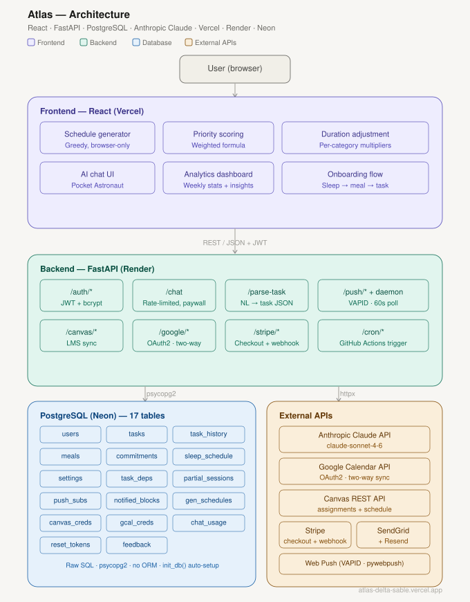

# Atlas

Atlas is a full-stack AI-powered daily scheduler that learns from your behavior over time. It generates an optimized schedule each day based on your tasks, deadlines, and availability then refines its estimates as it observes how long tasks actually take, when you're most productive, and how your day unfolds in practice.

The core idea: most scheduling tools treat your time as static. Atlas treats it as dynamic, adjusting to what actually happens and getting more accurate with each completed task.

🔗 **Live App:** [atlas-delta-sable.vercel.app](https://atlas-delta-sable.vercel.app)
🎥 **Demo Video:** coming soon

---

## Why It Exists

Students consistently underestimate how long tasks take, schedule work during low-energy hours, and fail to account for travel time, meals, and transitions. Existing tools (calendars, to-do apps) require manual planning and don't adapt to real behavior. Atlas automates the planning layer and closes the feedback loop between planned and actual.

---

## What It Does

- **Generates daily schedules** → fills your available time with tasks, breaks, meals, and commitments automatically
- **Prioritizes tasks dynamically** → ranks by urgency, importance, personal priority, and difficulty using a weighted scoring formula
- **Classifies deep vs. light work** → alternates cognitively demanding and lighter tasks to preserve focus
- **Schedules around peak hours** → places hardest tasks during your self-reported most productive window
- **Handles flexible and fixed commitments** → meals and commitments can have fixed times or be placed automatically in preferred windows
- **Models commute time** → blocks travel to and from any commitment requiring transportation, including return trips
- **Adjusts duration estimates** → computes per-category multipliers from history and silently corrects future task durations
- **Surfaces AI duration estimates** → shows adjusted duration on each task card before scheduling
- **Tracks cumulative partial progress** → logs duration across multiple partial sessions and sums them on final completion
- **Parses tasks from natural language** → describe a task in plain English and Atlas fills the form automatically using Claude AI
- **AI chat assistant** → ask Atlas AI anything about your schedule; it responds with full context of your tasks, meals, commitments, and today's generated blocks
- **Enforces task dependencies** → blocked tasks are excluded from the schedule until their prerequisites are complete
- **Supports recurring tasks** → weekly recurring tasks generate child instances automatically for each scheduled day
- **Commitment repeat-until options** → commitments can repeat forever, until a date, or a fixed number of times
- **Canvas LMS integration** → sync assignments and class schedule directly from your institution's Canvas instance
- **Google Calendar two-way sync** → import existing events or push your generated Atlas schedule to Google Calendar
- **Push notifications** → get notified before each scheduled block starts, with configurable lead time and block type filters
- **Weekly email reports** → receive a personalized weekly summary with stats and a Claude-generated narrative every week
- **Guided onboarding** → new users complete a three-step setup flow (sleep → meal → task) before reaching the main app
- **Collects behavioral feedback** → after each task, logs actual duration, actual difficulty, and completion status
- **Tracks estimation accuracy** → compares estimated vs. actual duration per task and by category
- **Identifies productive time patterns** → analyzes which time periods have the highest task completion rates
- **Surfaces smart suggestions** → detects overdue tasks, consistent underestimation patterns, and peak productivity windows
- **Weekly analytics** → summarizes the last 7 days of task activity, time spent, and estimation accuracy by category
- **Schedule flagging** → flag any block with a note describing what you'd like changed
- **Full account management** → update username, email, or password; forgot password/username via email; delete account
- **Persists everything** → all tasks, history, settings, and schedules saved to PostgreSQL

---

## How It Works

```
User inputs:
  Tasks (name, deadline, duration estimate, difficulty, importance, dependencies)
  Availability (sleep schedule, meals, commitments)
  Settings (energy pattern, buffers, max block length)
          │
          ▼
Priority Scoring Engine
  score = 0.35×urgency + 0.25×importance + 0.20×preference + 0.15×difficulty + 0.05×consistency
  consistency = per-category completion rate from history (default 0.5 until 2+ data points)
          │
          ▼
Duration Adjustment Engine
  per-category multiplier = total actual / total estimated (requires 2+ history entries)
  adjusted duration = estimated × multiplier
          │
          ▼
Schedule Generator
  1. Block fixed commitments and meals (+ commute time)
  2. Place flexible blocks in preferred windows
  3. Add shower, morning routine, wind-down buffers
  4. Interleave deep/light tasks by priority
  5. Prefer peak-hour windows for deep tasks; fall back to next available slot
  6. Insert breaks proportional to block length
  7. Fill remaining gaps with weighted task selection
  8. Skip blocked tasks (unmet dependencies)
          │
          ▼
Generated daily schedule + schedule notes
          │
          ▼
Feedback Collection (after each task)
  Actual duration (cumulative across partial sessions), actual difficulty,
  completion status, start/end time
          │
          ▼
History & Analytics
  Per-category multipliers, weekly stats, productive time analysis,
  completion rates by time of day, smart suggestions
```

---

## Tech Stack

| Layer | Technology |
|---|---|
| Frontend | React (Create React App) |
| Backend | FastAPI (Python) |
| Database | PostgreSQL (Neon) |
| Auth | JWT via `python-jose` + `bcrypt` |
| Email | SendGrid (password reset, username recovery) + Resend (weekly reports) |
| Payments | Stripe (one-time payment, webhook-based unlock) |
| AI | Anthropic Claude API (`claude-sonnet-4-6`) |
| Push notifications | Web Push API + `pywebpush` + VAPID |
| Calendar sync | Google Calendar API (OAuth2) |
| LMS sync | Canvas REST API |
| API communication | REST (JSON) |
| Frontend deployment | Vercel |
| Backend deployment | Render |

No ORM — raw SQL for transparency and simplicity.

---

## Architecture

```
User (Browser)
      │
      ▼
Frontend — React (Vercel)
  - Schedule Generator
  - Priority Scoring Engine
  - Duration Adjustment Engine
  - Analytics Dashboard
  - Onboarding Flow
  - AI Chat UI (Pocket Astronaut mascot)
      │
      │ REST API (JSON) + JWT Auth
      ▼
Backend — FastAPI (Render)
  - /auth/*         (register, login, me, reset, update, delete)
  - /tasks, /history, /sleep
  - /meals, /commitments, /settings
  - /parse-task     (AI — natural language task parsing, paywall-gated)
  - /chat           (AI — schedule-context-aware assistant, rate-limited)
  - /feedback
  - /push/*         (VAPID push notification subscriptions + daemon)
  - /schedule/save  (persist generated schedule for push notification targeting)
  - /canvas/*       (connect, sync assignments, sync schedule)
  - /google/*       (OAuth2, import events, export schedule)
  - /stripe/*       (checkout session, webhook)
  - /cron/*         (weekly email report, GitHub Actions triggered)
      │
      ├── psycopg2
      │       ▼
      │   Database — PostgreSQL (Neon)
      │     - users, tasks, task_history
      │     - task_dependencies, partial_sessions
      │     - meals, commitments, sleep_schedule
      │     - settings, password_reset_tokens, feedback
      │     - generated_schedules, notified_blocks
      │     - push_subscriptions
      │     - canvas_credentials
      │     - google_calendar_credentials
      │     - chat_usage
      │
      └── httpx
              ▼
          Anthropic Claude API
            - Natural language task parsing
            - Schedule chat assistant
            - Weekly email narrative generation
          SendGrid API
            - Password reset and username recovery emails
          Resend API
            - Weekly progress report emails
          Stripe API
            - One-time payment checkout + webhook unlock
          Google Calendar API
            - Two-way event sync (OAuth2 + token refresh)
          Canvas REST API
            - Assignment and class schedule import
```



### Component Responsibilities

- **Frontend (React)**: All business logic lives here. The schedule generator, priority scoring formula, and duration adjustment engine are pure JavaScript functions that run in the browser. The backend is never called for computation, only for persistence.
- **Backend (FastAPI)**: Stateless REST API. Receives data, writes to PostgreSQL, returns results. No scheduling logic, no business rules.
- **Schedule Generator**: Runs entirely in the browser. Takes tasks, meals, commitments, and sleep schedule as inputs and produces an ordered list of time blocks using a greedy first-fit algorithm with peak-hour awareness and deep/light work alternation. Blocked tasks (unmet dependencies) are automatically excluded.
- **Priority Scoring Engine**: Ranks tasks by a weighted formula: `0.35×urgency + 0.25×importance + 0.20×preference + 0.15×difficulty + 0.05×consistency`. Consistency is derived from per-category completion history.
- **Duration Adjustment Engine**: Computes per-task and per-category multipliers from history (`total actual / total estimated`) and silently adjusts scheduled durations. Requires 2+ history entries to activate. Adjusted estimates are also surfaced on each task card in the UI.
- **AI Chat Assistant**: Sends the user's message, full conversation history, and today's generated schedule blocks to `claude-sonnet-4-6`. Rate-limited to 50 messages per user per day. Gated behind the Stripe paywall or beta access flag.
- **Partial Session Tracker**: Accumulates duration across multiple "Partially Completed" feedback submissions. On final completion, sums all sessions and records the true total in task history.
- **Recurring Task Engine**: Templates with `isRecurring=1` lazily generate child task instances for each matching weekday within the next 7 days on every `GET /tasks` call. Child instances are not templates and do not re-generate.
- **Push Notification Daemon**: A background thread polls the database every 60 seconds, checks generated schedules for blocks starting within the user's configured lead window, and fires Web Push messages via VAPID. Expired subscriptions (HTTP 410) are automatically removed.
- **Canvas Sync**: Two endpoints — one imports assignments as tasks (with `externalId` deduplication), the other imports recurring class sessions as commitments from the Canvas calendar events API.
- **Google Calendar Sync**: OAuth2 flow with offline access and automatic token refresh. Import pulls upcoming events as one-off commitments. Export pushes the generated schedule to Google Calendar, tagging each event with a private `source=atlas` property to prevent re-import loops.
- **Stripe Paywall**: One-time $2.99 payment via Stripe Checkout. Webhook sets `is_paid = 1` on the user record. Beta users bypass the paywall via `beta_access = 1` or the `BETA_MODE` env var.
- **Weekly Email Cron**: A POST endpoint triggered by GitHub Actions on a daily schedule. Queries users whose `email_report_day` matches today, generates a Claude narrative for each, and sends via Resend.
- **Database (PostgreSQL on Neon)**: Seventeen tables storing all user data. Auto-created on first backend run via `init_db()`.
- **AI (Claude API)**: Powers natural language task parsing (`/parse-task`), the chat assistant (`/chat`), and weekly email narratives (`/cron/weekly-email`). Requires `ANTHROPIC_API_KEY`.
- **Email (SendGrid)**: Handles password reset links (token-based, 1-hour expiry) and username recovery emails. Requires `SENDGRID_API_KEY` and `SENDGRID_FROM_EMAIL`.

---

## Quick Demo

**Input:**
```
Tasks:
  - "Study for Computer Science exam" — due Friday, 3 hours estimated, high difficulty
  - "Review flashcards" — due Thursday, 30 min, low difficulty

Availability:
  - Wake: 8:00 AM, Sleep: 11:00 PM
  - Lunch: 12:00–12:30 PM (fixed)
  - Work shift: 5:00–9:00 PM (fixed, 20 min commute)
  - Energy pattern: morning person

Settings:
  - Morning buffer: 30 min, Max deep work block: 90 min
  - Shower: morning, 15 min
```

**Generated schedule:**
```
8:00 – 8:30   🌅 Morning routine
8:30 – 8:45   🚿 Shower
8:45 – 10:15  ⭐ Study for Computer Science exam (Deep Work — peak hours)
10:15 – 10:30 — Break —
10:30 – 11:00 Review flashcards (Light Work)
11:00 – 12:00 ⭐ Study for Computer Science exam (Deep Work — continued)
12:00 – 12:30 🍽 Lunch
12:30 – 1:30  Study for Computer Science exam (remaining block)
1:30 – 1:45   — Break —
4:40 – 5:00   🚗 Commute to Work shift
5:00 – 9:00   📌 Work shift
9:00 – 9:20   🚗 Commute back from Work shift
10:30 – 11:00 🌙 Wind down
```

**Schedule notes (after 2 weeks of use):**
```
⚠ Study for CS exam: duration adjusted from 180 to 243 min (+35% based on Studying history)
⚠ Review flashcards: duration adjusted from 30 to 25 min (-17% based on Homework history)
```

**Dashboard suggestions:**
```
💡 You tend to underestimate Studying tasks by 35% — try adding 35% more time when estimating.
💡 Your best work happens during Morning (6:00am–12:00pm) (87.5% completion rate) — try scheduling deep work then.
```

---

## Project Structure

```
Atlas/
├── frontend/
│   └── src/
│       ├── App.js              # All UI components and schedule generation logic
│       ├── Onboarding.js       # Guided three-step setup flow for new users
│       ├── ThemeContext.js     # Theme system and category/emoji mapping
│       ├── theme.css           # CSS custom properties for all themes
│       ├── App.css             # Layout and component styles
│       ├── Atlas_Logo192.png
│       └── index.js
│   └── public/
│       └── sw.js               # Service worker for Web Push notifications
├── backend/
│   └── main.py                 # FastAPI app — all REST endpoints, DB logic, and integrations
└── .github/
    └── workflows/
        └── weekly-email.yml    # GitHub Actions cron — triggers weekly email endpoint daily
```

All schedule generation is pure frontend logic (`generateSchedule()` in App.js). The backend is a stateless persistence layer only — no business logic lives there.

---

## Setup

### Backend
```bash
cd backend
pip install fastapi uvicorn pydantic psycopg2-binary bcrypt python-jose httpx python-multipart pywebpush stripe
```

Set the following environment variables:
```
DATABASE_URL=your_postgresql_connection_string
SECRET_KEY=your_jwt_secret_key
ANTHROPIC_API_KEY=your_anthropic_api_key
SENDGRID_API_KEY=your_sendgrid_api_key
SENDGRID_FROM_EMAIL=your_verified_sender_email
RESEND_API_KEY=your_resend_api_key
RESEND_FROM_EMAIL=Atlas <reports@yourdomain.com>
STRIPE_SECRET_KEY=your_stripe_secret_key
STRIPE_WEBHOOK_SECRET=your_stripe_webhook_signing_secret
STRIPE_PRICE_ID=your_stripe_price_id
VAPID_PUBLIC_KEY=your_vapid_public_key
VAPID_PRIVATE_KEY=your_vapid_private_key
GOOGLE_CLIENT_ID=your_google_oauth_client_id
GOOGLE_CLIENT_SECRET=your_google_oauth_client_secret
GOOGLE_REDIRECT_URI=https://your-backend-url/google/callback
FRONTEND_URL=https://your-frontend-url
BACKEND_URL=https://your-backend-url
CRON_SECRET=your_cron_secret
BETA_MODE=true
```

Generate VAPID keys once (do not regenerate — this rotates push subscriptions):
```bash
python -c "from py_vapid import Vapid; v = Vapid(); v.generate_keys(); print(v.public_key, v.private_key)"
```

```bash
python -m uvicorn main:app --reload
```
Runs at `http://localhost:8000`. Interactive API docs at `http://localhost:8000/docs`.

### Frontend
```bash
cd frontend
npm install
```

Create a `.env` file:
```
REACT_APP_API_URL=http://localhost:8000
```

```bash
npm start
```
Runs at `http://localhost:3000`.

---

## Database Schema

| Table | Purpose |
|---|---|
| `users` | User accounts with hashed passwords, payment status, and beta access flag |
| `tasks` | Task metadata, estimates, completion feedback, and recurrence config |
| `task_history` | Immutable record of each completed task session |
| `task_dependencies` | Dependency relationships between tasks |
| `partial_sessions` | Tracks cumulative duration across partial task completions |
| `meals` | Meals with fixed or flexible time scheduling |
| `commitments` | Recurring and one-off commitments with commute, flex, and repeat-until support |
| `sleep_schedule` | Planned and actual wake/sleep times |
| `settings` | User preferences (clock format, buffers, energy pattern, shower, notifications, etc.) |
| `password_reset_tokens` | Token-based password reset flow (1-hour expiry) |
| `feedback` | User-submitted bug reports and feature requests |
| `generated_schedules` | Persisted daily schedule blocks (used by push notification daemon) |
| `notified_blocks` | Deduplication log for push notifications already sent |
| `push_subscriptions` | Web Push endpoint + VAPID keys per user device |
| `canvas_credentials` | Canvas domain and access token per user |
| `google_calendar_credentials` | Google OAuth2 access token, refresh token, and expiry per user |
| `chat_usage` | Per-user daily chat message count for rate limiting |

---

## API Endpoints

| Method | Path | Purpose |
|---|---|---|
| POST | `/auth/register` | Create a new user account |
| POST | `/auth/login` | Log in and receive a JWT token |
| GET | `/auth/me` | Return current user's username, payment, and beta status |
| PUT | `/auth/update-account` | Update username, email, or password |
| DELETE | `/auth/delete-account` | Permanently delete account and all data |
| POST | `/auth/forgot-password` | Send password reset link via email |
| POST | `/auth/reset-password` | Reset password via token |
| POST | `/auth/forgot-username` | Send username reminder via email |
| GET/POST | `/tasks` | List all / add task (GET lazily generates recurring instances) |
| PUT | `/tasks/{id}` | Edit task |
| DELETE | `/tasks/{id}` | Delete task |
| PATCH | `/tasks/{id}/feedback` | Submit completion feedback (supports partial sessions) |
| GET | `/tasks/{id}/partial-total` | Get cumulative duration from partial sessions |
| POST | `/tasks/{id}/dependencies` | Add a task dependency |
| DELETE | `/tasks/{id}/dependencies/{dep_id}` | Remove a task dependency |
| GET | `/history` | Full task history |
| GET/POST | `/meals` | List all / add meal |
| PUT | `/meals/{id}` | Edit meal |
| PATCH | `/meals/{id}/actual` | Log actual meal times |
| DELETE | `/meals/{id}/actual` | Clear logged actual meal times |
| DELETE | `/meals/{id}` | Delete meal |
| GET/POST | `/commitments` | List all / add commitment |
| PUT | `/commitments/{id}` | Edit commitment |
| DELETE | `/commitments/{id}` | Delete commitment |
| GET/POST | `/sleep` | Get / save sleep schedule |
| PATCH | `/sleep/actual` | Log actual sleep times |
| DELETE | `/sleep/actual` | Clear logged actual sleep times |
| GET/POST | `/settings` | Get all / save a setting |
| POST | `/settings/email-report-day` | Save preferred weekly email report day |
| POST | `/parse-task` | Parse natural language into structured task JSON (AI, paywall-gated) |
| POST | `/chat` | AI scheduling chat assistant (rate-limited, schedule-context-aware) |
| POST | `/feedback` | Submit bug report or feature request |
| POST | `/schedule/save` | Persist generated schedule for push notification targeting |
| GET | `/push/vapid-public-key` | Return VAPID public key for client subscription |
| POST | `/push/subscribe` | Register a Web Push subscription |
| POST | `/push/unsubscribe` | Remove a Web Push subscription |
| POST | `/stripe/create-checkout-session` | Create Stripe checkout session for AI unlock |
| POST | `/stripe/webhook` | Handle Stripe payment confirmation and set is_paid |
| POST | `/cron/weekly-email` | Send weekly progress report emails (GitHub Actions triggered) |
| POST | `/canvas/connect` | Save Canvas domain and access token |
| DELETE | `/canvas/disconnect` | Remove Canvas credentials |
| GET | `/canvas/status` | Check Canvas connection status |
| POST | `/canvas/sync/assignments` | Import assignments as tasks from Canvas |
| POST | `/canvas/sync/schedule` | Import class sessions as commitments from Canvas |
| GET | `/google/auth-url` | Return Google OAuth2 authorization URL |
| GET | `/google/callback` | Handle OAuth2 redirect and store tokens |
| DELETE | `/google/disconnect` | Remove Google Calendar credentials |
| GET | `/google/status` | Check Google Calendar connection status |
| POST | `/google/sync/import` | Import upcoming Google Calendar events as commitments |
| POST | `/google/sync/export` | Push generated schedule blocks to Google Calendar |

All endpoints except `/auth/register`, `/auth/login`, `/auth/forgot-password`, `/auth/reset-password`, `/auth/forgot-username`, `/google/callback`, and `/stripe/webhook` require a `Bearer` token in the `Authorization` header.

---

## Current Status

**Phase 1 — Complete:**
- Task input with name, description, deadline, category, difficulty, importance, duration
- Auto deep/light work classification with keyword matching and user override
- Custom keywords in Settings
- Priority scoring: `0.35×urgency + 0.25×importance + 0.20×preference + 0.15×difficulty + 0.05×consistency`
- Daily availability: sleep schedule, fixed and flexible meals and commitments
- Commute time (to and from) for meals and commitments
- Shower scheduling (duration + morning/evening/after-gym preference)
- Schedule generation with morning routine, breaks, peak hours, deep/light alternation
- Full persistence for all data types
- Full CRUD for tasks, meals, commitments
- Settings: clock format, max block length, buffers, transition gap, energy pattern, shower

**Phase 2 — Complete:**
- Task feedback: completion status, actual duration (timer or manual), actual difficulty
- Task timer with Start/Stop
- History system with per-task and overall accuracy
- Category breakdown stats
- Duration adjustment engine: per-category multipliers from history, applied silently at schedule time
- AI duration estimate surfaced on task cards (shows adjusted min before scheduling)
- Personalized priority scoring: consistency factor driven by real completion rate per category
- Weekly analytics dashboard: task counts, time estimated vs. actual, accuracy, category breakdown
- Productive time analysis: completion rate per time period
- Schedule adjustment summary: duration adjustments, unscheduled tasks, user-flagged blocks
- Smart suggestions: overdue tasks, underestimation patterns, peak productivity nudges

**Phase 3 — Complete:**
- User accounts and authentication (JWT + bcrypt)
- Full account management: update credentials, forgot password/username via SendGrid, delete account
- PostgreSQL database (Neon)
- Frontend deployed to Vercel, backend deployed to Render (keep-alive ping)
- Natural language task input via Anthropic Claude API
- Task dependencies with blocked task detection and schedule exclusion
- Cumulative duration tracking across partial task completions
- Schedule block flagging with user notes
- Recurring weekly tasks via template-based lazy instantiation
- Commitment repeat-until options (forever / until date / fixed occurrences)
- Canvas LMS integration: assignment import, class schedule import
- Google Calendar two-way sync: OAuth2, import, export, automatic token refresh
- Push notifications: VAPID, service worker, configurable lead time and block type filters
- Guided onboarding flow for new users (sleep → meal → task)
- `fetchJsonOrLogout` — catches stale 401s and clears tokens to prevent render crashes

**Phase 4 — Complete:**
- AI chat assistant with full schedule context injection and conversation history
- Pocket Astronaut mascot (wave, think, cheer, analyze moods)
- Weekly review summary email via Resend with Claude-generated narrative
- GitHub Actions cron trigger for weekly emails (runs daily, matches user's preferred day)
- AI duration estimation surfaced in task cards (→ adjusted min)
- Natural language task parsing gated behind paywall
- Stripe one-time payment ($2.99) with webhook-based unlock
- Beta access system with `BETA_MODE` env var override
- Per-user daily chat rate limiting (50 messages/day)
- `/auth/me` endpoint for persistent payment status across page refreshes
- Markdown rendering in AI chat responses

**Phase 5 — Planned:**
- UI redesign with Tailwind CSS
- Mobile responsiveness
- Per-day availability (different schedules per weekday)
- Disruption recovery (regenerate remaining schedule when day goes off-plan)

---

## Future Directions

- **ML-based duration prediction**: train a lightweight regression model on task history to predict durations more accurately than simple averages, incorporating task type, category, time of day, and self-reported difficulty
- **Disruption recovery**: detect when the day goes off-plan (late wake, skipped meal) and regenerate the remaining schedule in real time
- **Per-day availability**: different meals, sleep times, and commitments for each day of the week
- **Optimization algorithm research**: the current scheduler is greedy (first-fit). A constraint satisfaction or integer programming approach could find globally better schedules, especially under tight availability constraints
